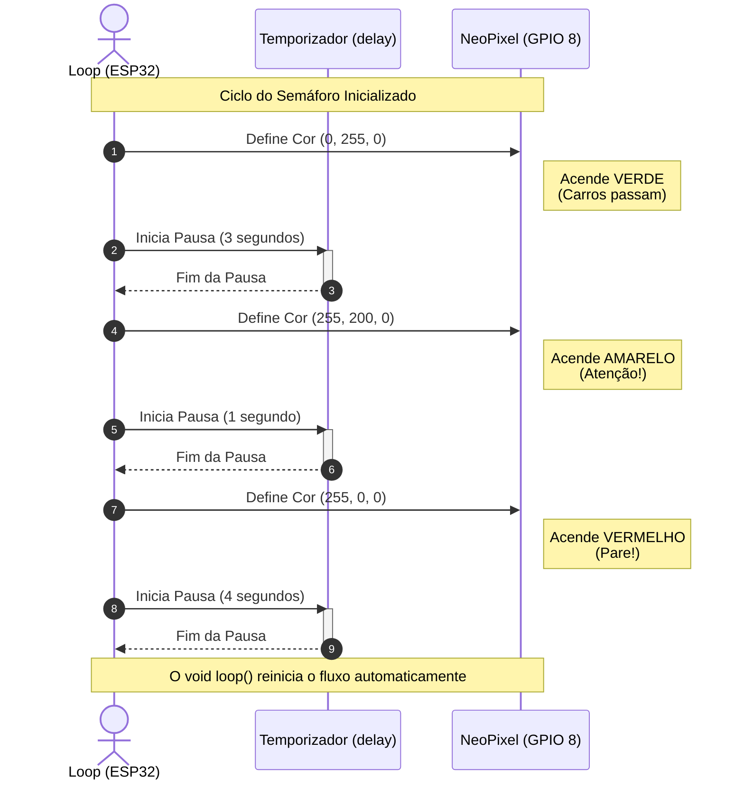

```mermaid
sequenceDiagram
    autonumber
    actor ESP32 as Loop (ESP32)
    participant Tempo as Temporizador (delay)
    participant LED as NeoPixel (GPIO 8)

    Note over ESP32, LED: Ciclo do Semáforo Inicializado

    %% Fase Verde
    ESP32->>LED: Define Cor (0, 255, 0)
    Note right of LED: Acende VERDE<br>(Carros passam)
    ESP32->>Tempo: Inicia Pausa (3 segundos)
    activate Tempo
    Tempo-->>ESP32: Fim da Pausa
    deactivate Tempo

    %% Fase Amarela
    ESP32->>LED: Define Cor (255, 200, 0)
    Note right of LED: Acende AMARELO<br>(Atenção!)
    ESP32->>Tempo: Inicia Pausa (1 segundo)
    activate Tempo
    Tempo-->>ESP32: Fim da Pausa
    deactivate Tempo

    %% Fase Vermelha
    ESP32->>LED: Define Cor (255, 0, 0)
    Note right of LED: Acende VERMELHO<br>(Pare!)
    ESP32->>Tempo: Inicia Pausa (4 segundos)
    activate Tempo
    Tempo-->>ESP32: Fim da Pausa
    deactivate Tempo

    Note over ESP32, LED: O void loop() reinicia o fluxo automaticamente
```