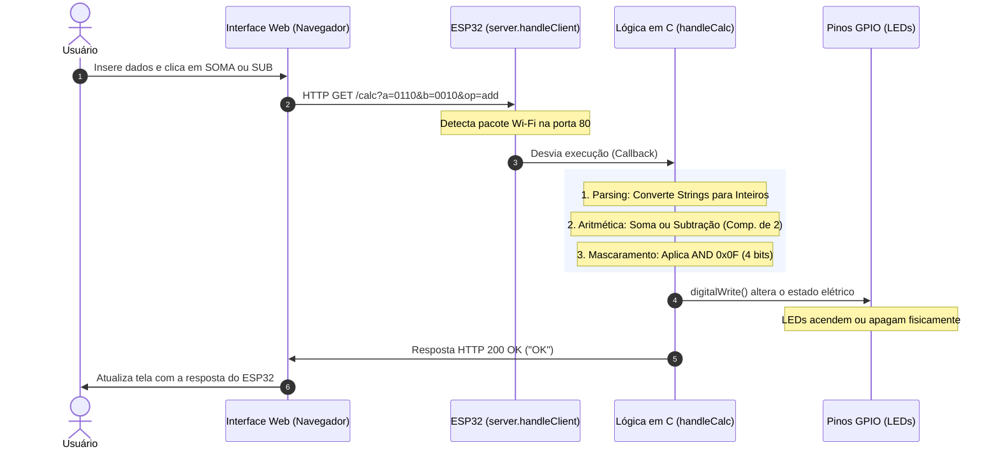

```mermaid
sequenceDiagram
    autonumber
    actor Usuario as Usuário
    participant Front as Interface Web (Navegador)
    participant Server as ESP32 (server.handleClient)
    participant C as Lógica em C (handleCalc)
    participant GPIO as Pinos GPIO (LEDs)

    Usuario->>Front: Insere dados e clica em SOMA ou SUB
    Front->>Server: HTTP GET /calc?a=0110&b=0010&op=add
    Note over Server: Detecta pacote Wi-Fi na porta 80
    Server->>C: Desvia execução (Callback)
    
    rect rgb(240, 245, 255)
        Note over C: 1. Parsing: Converte Strings para Inteiros
        Note over C: 2. Aritmética: Soma ou Subtração (Comp. de 2)
        Note over C: 3. Mascaramento: Aplica AND 0x0F (4 bits)
    end
    
    C->>GPIO: digitalWrite() altera o estado elétrico
    Note over GPIO: LEDs acendem ou apagam fisicamente
    C->>Front: Resposta HTTP 200 OK ("OK")
    Front->>Usuario: Atualiza tela com a resposta do ESP32
```